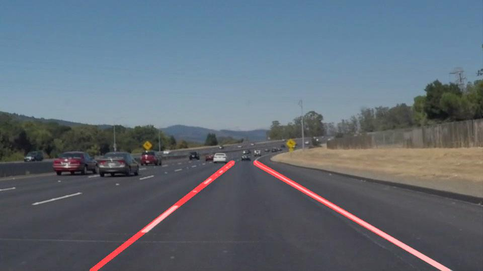
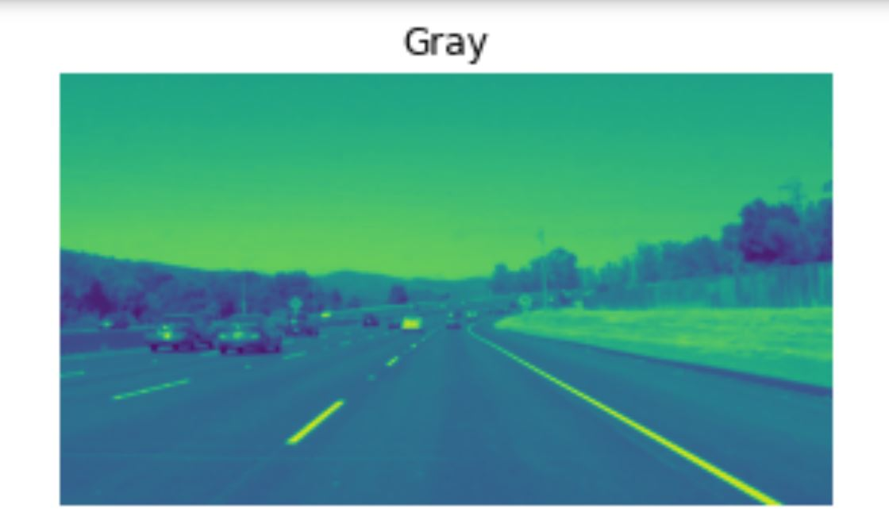
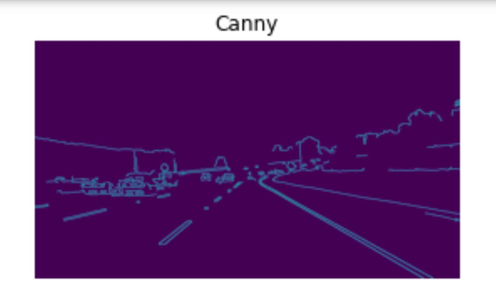
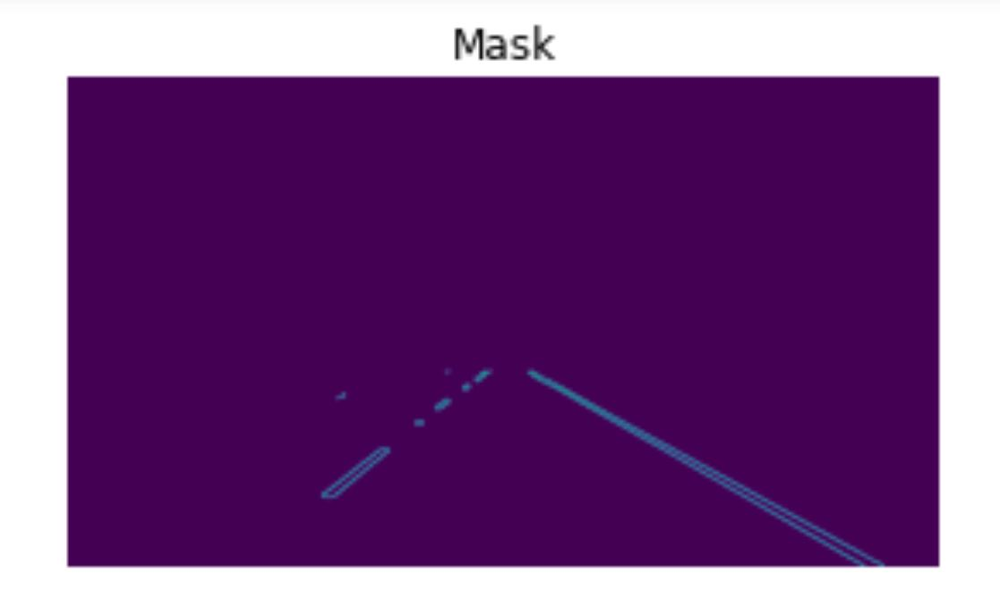
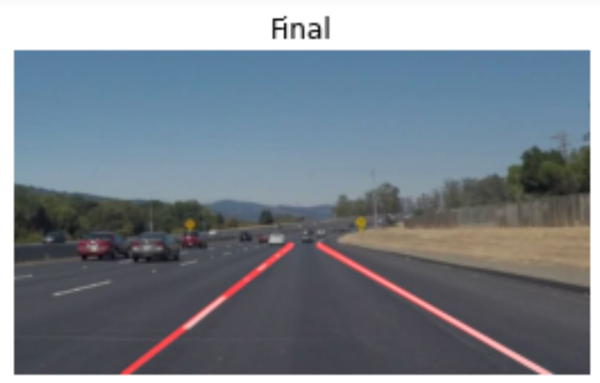

# Project 1 - Finding Lane Lines on the Road

The Goal
---
The goal of this project is to automatically detect lane lines on a road.

Input Image                |  Output Image
:-------------------------:|:-------------------------:
  | 

The Pipeline
---
Several pipelines were used to approach this problem. The first approach was to start by selecting all the pixels above a certain brightness since lane marks are usually brighter than other components on a road image. This caused some issues while detecting non-white lane marking so this method was dropped. Here is the final pipeline used:
1. Convert the image to grayscale.

2. Slightly blur the image.

3. Perform edge detection.

4. Only keep the area of interest.

5. Using hough lines and np.polyfit(), determine the best line to represent the left and right lane.

6. Tune the parameters until satisfied.

7. Blend the initial image and the lines together.

Shortcomings
---
The algortithm used works great for this camera angle. Changing the camera's position will require more parameters tuning. This proves that the algorithm does not generalize well.

Possible Improvements
---
1. Modify the pipeline to generalize for all camera angle. The performance greatly increased when a line with slope > 0.5 was declared as left and < 0.5 as right lane. Modify the slope limit could help this.
2. Averaging the lines between frames in a video could help smoothing detection during the video.
