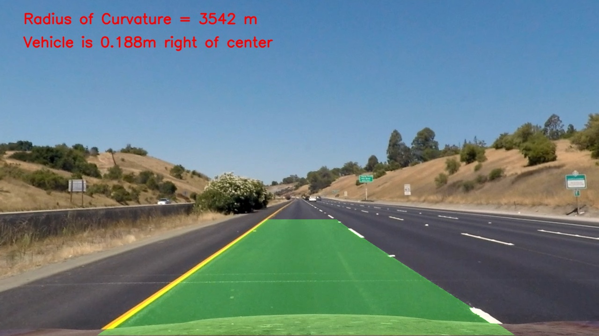
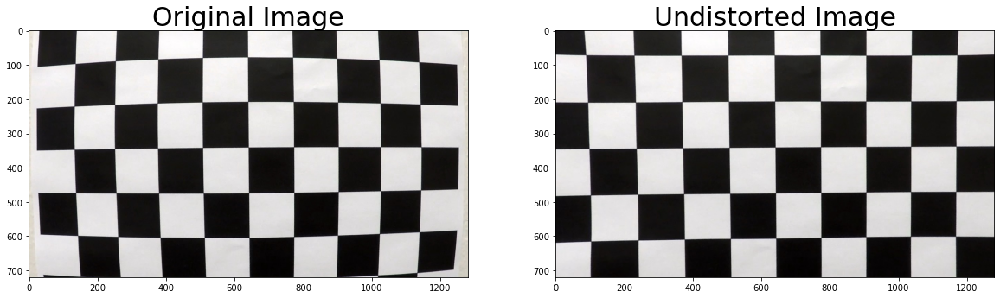
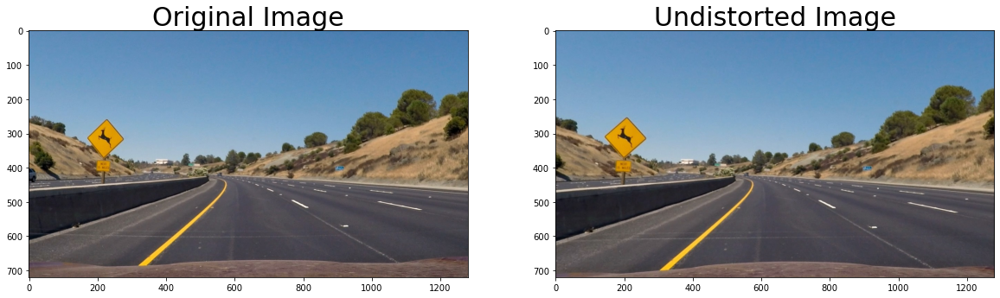
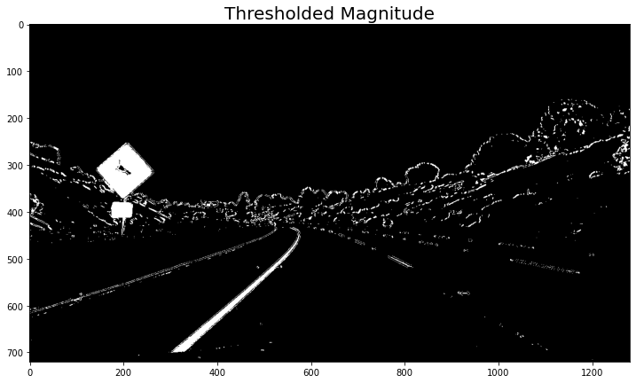
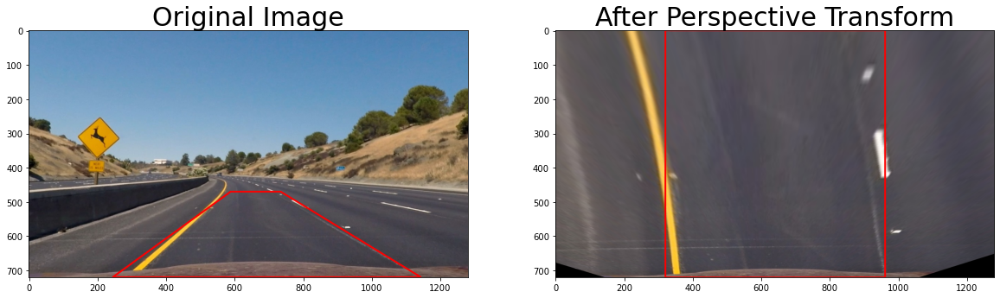
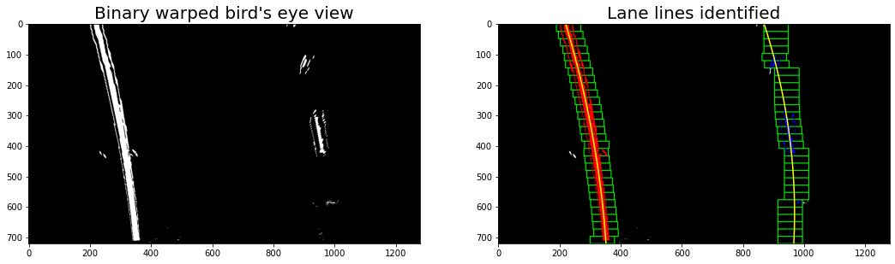
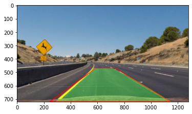
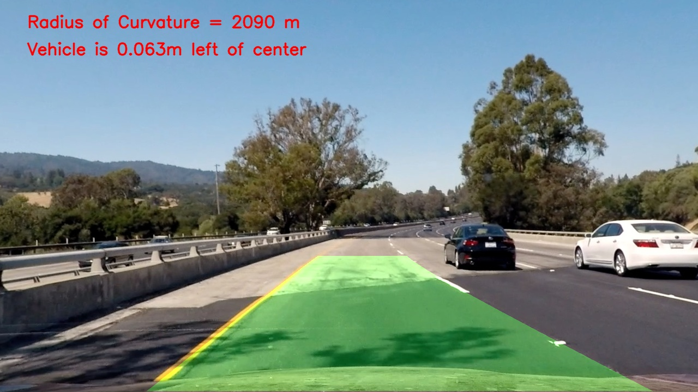

# **Advanced Finding Lane Lines on the Road** 

The Goal
---
The goal of this project is to automatically detect lane lines on a road, calculate the curvature and the position of the vehicle with respect to the lane

Input Image                |  Output Image
:-------------------------:|:-------------------------:
  | 

The Pipeline
---
1. Compute the camera calibration matrix and distortion coefficients given a set of chessboard images. 
2. Apply a distortion correction to raw images. 
3. Use color transforms, gradients, etc., to create a thresholded binary image. 
4. Apply a perspective transform to rectify binary image ("birds-eye view"). 
5. Detect lane pixels and fit to find the lane boundary. 
6. Determine the curvature of the lane and vehicle position with respect to center. 
7. Warp the detected lane boundaries back onto the original image. 
   
   
8. Output visual display of the lane boundaries and numerical estimation of lane curvature and vehicle position. 
9. Create a pipeline for videos. 
  
  

Shortcomings
---
The algorithm works well when there is no change in light exposure but could struggle if it goes under a bridge for example.

Possible Improvements
---
Only check neighbor pixels to the lanes detected in the previous frame.
