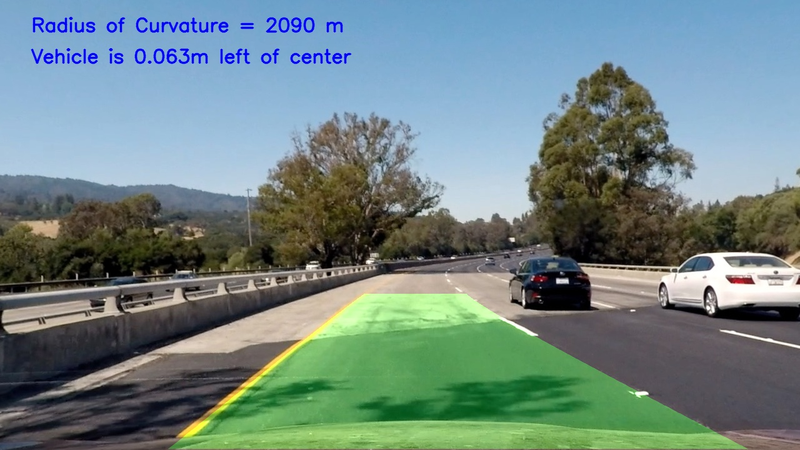

# **Advanced Finding Lane Lines on the Road** 

The Goal
---
The goal of this project is to automatically detect lane lines on a road, calculate the curvature and the position of the vehicle with respect to the lane

Input Image                |  Output Image
:-------------------------:|:-------------------------:
  | 

The Pipeline
---
1. Compute the camera calibration matrix and distortion coefficients given a set of chessboard images. 
2. Apply a distortion correction to raw images. 
3. Use color transforms, gradients, etc., to create a thresholded binary image. 
4. Apply a perspective transform to rectify binary image ("birds-eye view"). 
5. Detect lane pixels and fit to find the lane boundary. 
6. Determine the curvature of the lane and vehicle position with respect to center. 
7. Warp the detected lane boundaries back onto the original image. 
8. Output visual display of the lane boundaries and numerical estimation of lane curvature and vehicle position. 

Shortcomings
---
The algortithm used works great for this camera angle. Changing the camera's position will require more parameters tuning. This proves that the algorithm does not generalize well.

Possible Improvements
---
1. Modify the pipeline to generalize for all camera angle. The performance greatly increased when a line with slope > 0.5 was declared as left and < 0.5 as right lane. Modify the slope limit could help this.
2. Averaging the lines between frames in a video could help smoothing detection during the video.
