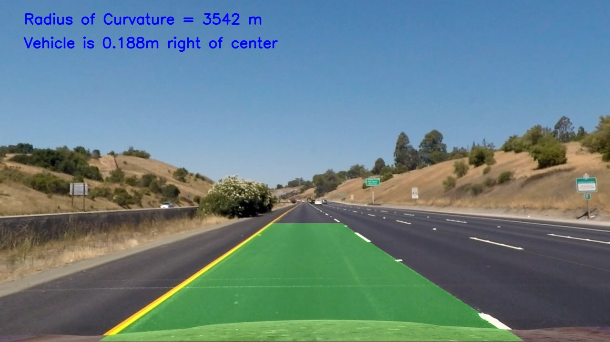

# **Advanced Finding Lane Lines on the Road** 

The Goal
---
The goal of this project is to automatically detect lane lines on a road, calculate the curvature and the position of the vehicle with respect to the lane

Input Image                |  Output Image
:-------------------------:|:-------------------------:
  | 

The Pipeline
---
1. Compute the camera calibration matrix and distortion coefficients given a set of chessboard images.

camera_calibrate() was created to populate object points and image points, these paramters are essential to compute the matrix and distorion matrix. 

2. Apply a distortion correction to raw images. 

undistort_img() takes as argument the raw picture, the object and image points calculated in step 1 to calculate the needed matrices. Then using the funvtion cv2.undistort() , the image was undistorted.

3. Use color transforms, gradients, etc., to create a thresholded binary image. 

For this step, the different methods implemented in the earlier stage of the course was used. After trying multiple combinations and tuning the parameters, the following method was used:
a. A first image representing the sobel along the x direction was produced. The pixles in a certain range was kept.
b. The sobels of the x and y of the raw image were calculated and their magnitudes were recorded. The pixles in a certain range was kept.
c. The raw image was converted to HSL and only the Saturation channel was kept. The pixles in a certain range was kept.
d. The three images created above were combined to create the image below:

4. Apply a perspective transform to rectify binary image ("birds-eye view"). 

The method perspective_trans() was used to transform the perspective. The getPerspectiveTransform() function was used to find the transformation matrix. Then the  warpPerspective() function was used to perform the transormation. The source and destination pixel can be found the table below:

| Source        | Destination   | 
|:-------------:|:-------------:| 
| 588, 470      | 320, 0        | 
| 245, 719      | 320, 720      |
| 1142, 719     | 960, 720      |
| 734, 470      | 960, 0        |

The image below shows the restult of this step.

5. Detect lane pixels and fit to find the lane boundary. 
6. Determine the curvature of the lane and vehicle position with respect to center. 

To perform step 5 & 6, the function curvature_eval() was created. This function creates a histogram to detect the left and right lanes. and then draws window which can be seen in the image below. Then, using np.polyfit, we fit a second order polynomial to each lane. The polynomial is then converted to meters per pixel which can be used to calculate the curvature of the lines. Then, assuming the the camera is mounted at the center of the car, the position of the vehicle with respect to the lanes is calculated.

7. Warp the detected lane boundaries back onto the original image. 

The map_color() function is used to display the path between both lanes detected. 

8. Output visual display of the lane boundaries and numerical estimation of lane curvature and vehicle position.

The text containing the desired information is added by the map_curv function(). It uses putText() to display the messages.

9. Create a pipeline for videos. 

this was a very challenging step since we want to take into consideration previous frames while detecting the lines to produce a smooth video. A class called MyVideoProcessor() was used to help with this step. It took into consideration each lanes and the information calculated in previous frames. Once over 10 frames were processed, the 10 last frames were traken into consideration when calculating the curvature.

Shortcomings
---
The algorithm works well when there is no change in light exposure but could struggle if it goes under a bridge for example.

Possible Improvements
---
Only check neighbor pixels to the lanes detected in the previous frame.
