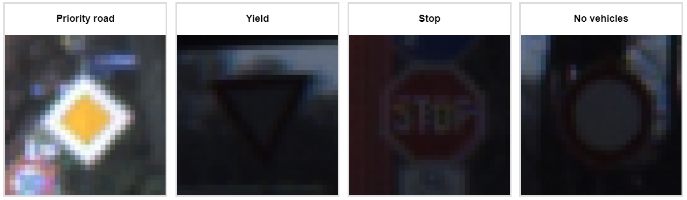
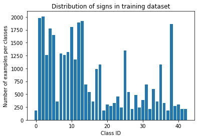
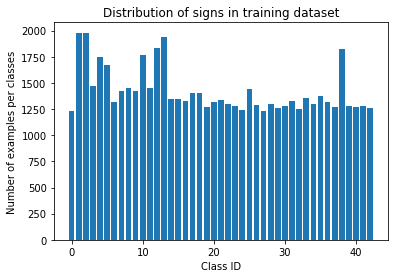
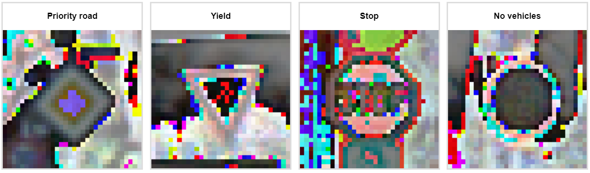
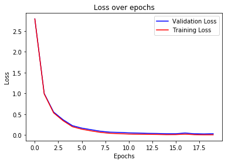
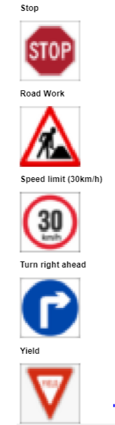
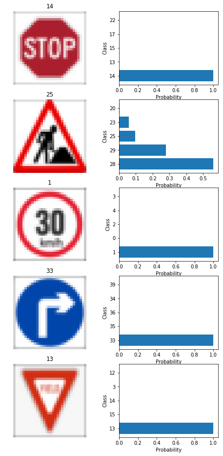

# **Traffic Sign Recognition** 
---

**Build a Traffic Sign Recognition Project**

The goal of this project is to build a CNN in TensorFlow to classify traffic sign images:
* Load the data set
* Explore, summarize and visualize the data set
* Design, train and test a model architecture
* Use the model to make predictions on new images
* Analyze the softmax probabilities of the new images

### Data Set Summary & Exploration

I used the pandas library to calculate summary statistics of the traffic
signs data set:

* Number of training examples = 34799
* Number of testing examples = 12630
* Image data shape = (32, 32, 3)
* Number of classes = 43

The notebook contains a cell showing all the classes and their respective sign. Here is a preview:

Here is an exploratory visualization of the data set. It is a bar chart showing the class distribution for training and validation set combined before data augmentation.

### Design and Test a Model Architecture

The first step was to balance the dataset. This ensures that each class has an adequate amount of training. To balance the dataset, augmentation techniques were used. Classes with low number of data had their images rotated, zoomed, and shifted to increase the number of examples to train on. After this step, the training dataset looked as such:

The dataset was then normalized so that every value is between 0 and 1. The purpose of normalizing is to make every feature of equal importance while training. The notebook contains a cell showing each class normalized. Here is a preview:

 

My final model consisted of the following layers:

| Layer         		|     Description	        					| 
|:---------------------:|:---------------------------------------------:| 
| Input         		| 32x32x3 RGB image   							| 
| Convolution 3x3     	| 1x1 stride, same padding, outputs 32x32x32 	|
| RELU					|												|
| Max pooling	      	| 2x2 stride, same padding, outputs 16x16x32 				|
| Convolution 3x3	    | 1x1 stride, same padding, outputs 16x16x64      									|
| RELU					|												|
| Max pooling	      	| 2x2 stride, same padding, outputs 8x8x64 				|
| Convolution 3x3	    | 1x1 stride, same padding, outputs 8x8x128      									|
| RELU					|												|
| Max pooling	      	| 2x2 stride, same padding, outputs 4x4128 				|
| Flatten   | 2048 |
| Fully connected		| 128       									|
| RELU					|												|
| Fully connected		| 43       									|
| Softmax				| 43        									|
 

I tuned the parameters and kept track of the combinations which performed the best on the the validation set. The best performing parameters were:
* Optimizer: AdamOptimizer
* Dropout: 0.6
* Learning rate: 0.001 
* EPOCHS: 20

The graph of epochs vs loss and epochs vs accuracy were plotted for validation and training. This is to check if the model is overfitting.
 

 

Since the loss on the validation set is always decreasing, we can confirm that the model generalizes well.

After training, the model had an accuracy of:
* Training: 99.9%
* Validation: 99.2%
* Testing: 91.4 %

The lower accuracy on the testing set might be due to the restricted amount of data.
 

### Test a Model on New Images

The following images were used to evaluate the model:

These 5 images were chosen because they each have a different combination of shape, color and symbol.

Here are the results of the prediction:

| Image			        |     Prediction	        					| 
|:---------------------:|:---------------------------------------------:| 
| Stop       		| Stop    									| 
| Road Work     			| Children crossing 										|
| 30 km/h					| 30 km/h   |
| Turn right ahead	      		| Turn right ahead		 				|
| Yield		| Yield     							|

The model was able to correctly guess 4 of the 5 traffic signs, which gives an accuracy of 80%.

Interestingly, the model was very confident of its choice when it predicted the right classes, but not confident when predicting the wrong one.

In the image above, we can see that the model is unsure about the road work sign and lean towards childen crossing, which also has a human on the sign. This shows that the model was able to extract the human features from the sign!

Overall, the attempt to classify roadsigns using neural networks was successful but having a larger dataset would considerably help.
