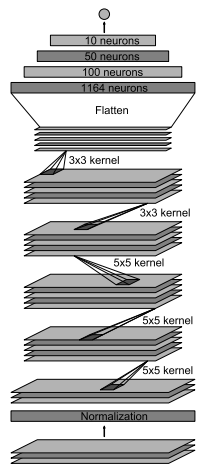
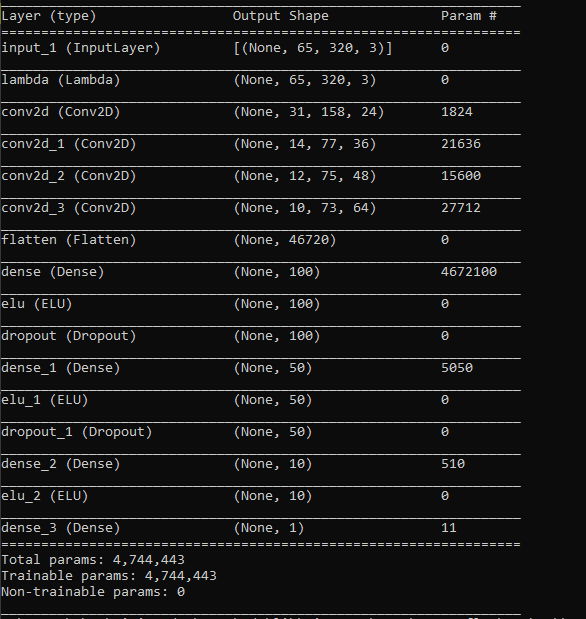
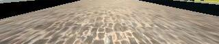

**Behavioral Cloning Project**

The steps of this project are the following:
* Use the simulator to collect data of good driving behavior
* Build, a convolution neural network in Keras that predicts steering angles from images
* Train and validate the model with a training and validation set
* Test that the model successfully drives around track one without leaving the road

## Rubric Points
### Here I will consider the [rubric points](https://review.udacity.com/#!/rubrics/432/view) individually and describe how I addressed each point in my implementation.  

---
### Files Submitted & Code Quality

#### 1. Submission includes all required files and can be used to run the simulator in autonomous mode

My project includes the following files:
* model.py containing the script to create and train the model
* drive.py for driving the car in autonomous mode
* nvdia3.h5 containing a trained convolution neural network 
* writeup_report.md summarizing the results

#### 2. Submission includes functional code

Using the Udacity provided simulator and my drive.py file, the car can be driven autonomously around the track by executing 
```sh
python drive.py nvdia3.h5
```

#### 3. Submission code is usable and readable

The model.py file contains the code for training and saving the convolution neural network. The file shows the pipeline I used for training and validating the model, and it contains comments to explain how the code works.

### Model Architecture and Training Strategy

#### 1. Model Architecture

Several models were trained to tackle this task. Finally, I ended up borrowing the model from the [NVIDIA paper](https://arxiv.org/pdf/1604.07316v1.pdf) in which they map raw pixels from a single front-facing camera directly to steering commands. The structure can be seen between line 58-73 of model.py. The functional API was used to build the model to accomodate for more complex tasks if needed. It is worth noting that my architecture is slightly different than the NVIDIA's paper because our input sizes differ.

Below is a screenshot of the model architecture and the summary of the model.

 

The model includes RELU and ELU layers to introduce nonlinearity, and the data is normalized in the model using a Keras lambda layer (model.py line 59).


#### 2. Preventing overfitting

The model contains dropout layers in order to reduce overfitting (model.py lines 67,70). 

#### 3. Model parameter tuning

The model used an adam optimizer, so the learning rate was not tuned manually (model.py line 89).
Several models were trained and the one which had the lowest MSE on the validation set was kept.

#### 4. Appropriate training data

Training data was chosen to keep the vehicle driving on the road. I used a combination of center lane driving, recovering from the left and right sides of the road. I used all three camera angle (left, middle, right) to train the model. Since the simulation only used the middle camera, a correction angle was used for the left and right camera to make them act as the middle camera. Furthermore, to decrease noise which was not relevant to the track (i.e the sky), the training images were cropped. The new dimensions are the images fed to the model were (65,320,3). The data was split into training/validation sets in a ration 8:2. Now that we tripled the amount of by using the 3 cameras (56,817 images) and reduced noise by elimnating the sky, the model can be refined to enhance the performance of the car.

 

Above, we can see how the images were cropped to remove noise.

### Model Architecture and Training Strategy

#### 1. Solution Design Approach

At first, I built a simple model with only one Convolution Neuron to ensure the pipeline was correct from training data to testing the model on the track. Once this worked, I built a first model replicating LeNet and trained on the front image only. With this model, the car was struggling to do tight turns so I had to make it more complex. I opted to use the NVDIA's paper's architecture mentionned above, adding dropout layers to generalize. Now that the model was in place, that we had collected enough data, the model was trained using fit_generator and the data was fed to the model using the generator function (model.py line 22,49). Training took 1.5 hours on an NVDIA RTX 3080.

At the end of the process, the vehicle is able to drive autonomously around the track without leaving the road.

#### 2. Testing the model

As seen in the video below, the vehicle successfully drives around the track. The speed of car was also increased from 9 mph to 20 mph to make it more challenging. Note that the image input in drive.py (line 64) had to be adjusted to match the input of the model. In the second part of the video, we can see the vehicle accomplish challenging turns in the second track.

[](http://www.youtube.com/watch?v=YOUTUBE_VIDEO_ID_HERE "Video Title")
