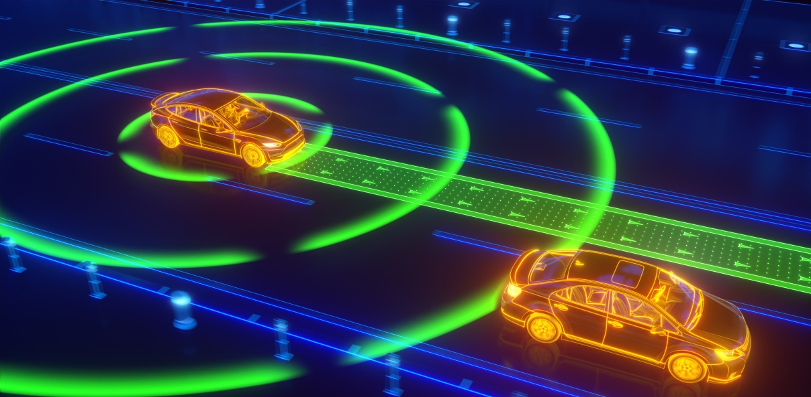
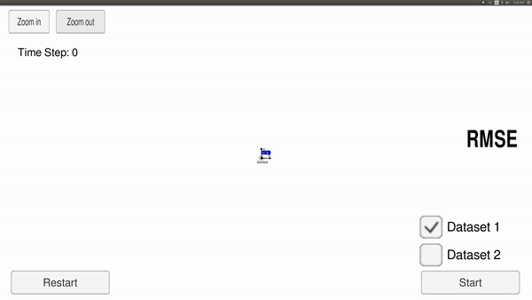
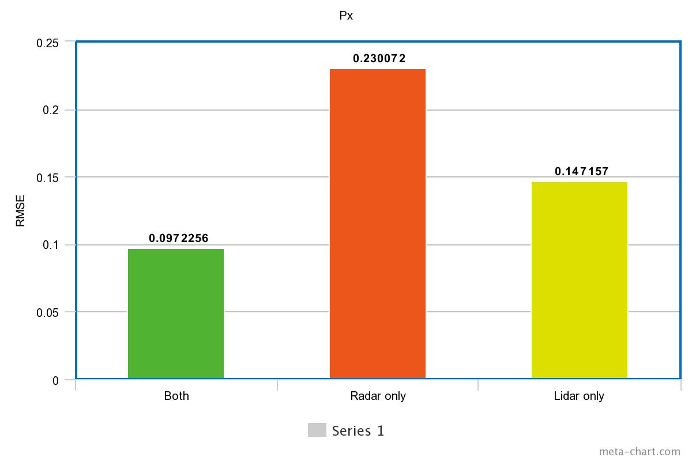
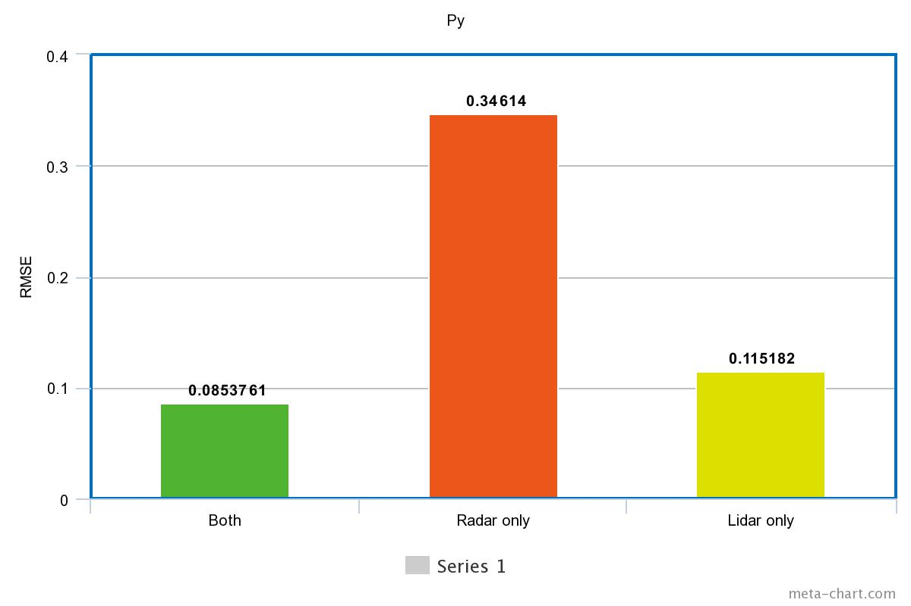
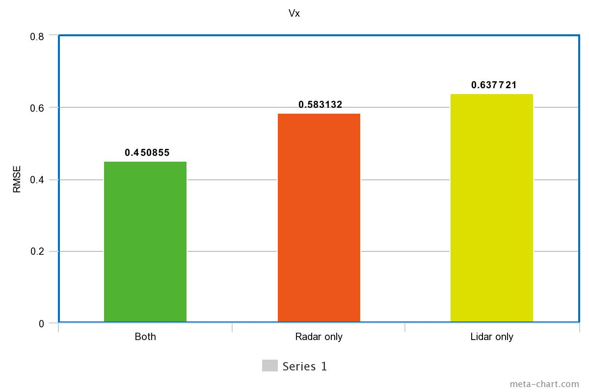
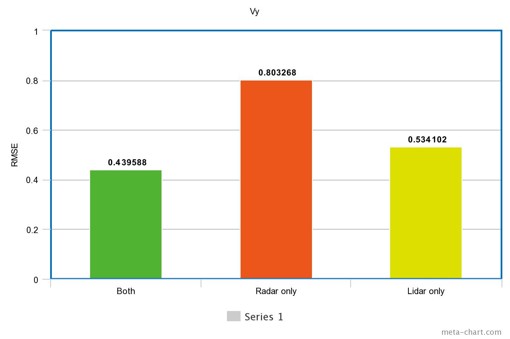

# Project 5 - Extended Kalman Filter / Sensor Fusion

  

Overview
---

This project consists of using lidar and radar measurements to predict the state of a moving object via Extended Kalman Filter. Sensor fusion was a key aspect for this project. The goal was to keep the RMSE below the threshold outlined in the project [rubric](https://review.udacity.com/#!/rubrics/748/view).

RADAR
---

* RAdio Detection And Rangeing (Radar) has been used for many years in the automotive industry.
* This measurement tool uses the Doppler effect to localize and object and measure its speed.
* Radar is less affected by rain and fog than other sensors used on car ( camera, Lidars).
* It has a field of view of 150 degrees and a range of 200+ m.

LIDAR
---  

* LIght Detection And Ranging (LIDAR) uses infrared light laser beam to determine the distance between the sensor and objects.
* It returns a high resolution point-cloud data which can be used to localize objects.

Dependencies
---

This project requires [C++](https://isocpp.org/) and the following C++ libraries installed:  
  
  Eigen Library - [git clone](https://gitlab.com/libeigen/eigen.git) 
  

Process Flow
---

* There is an object represented by a 2-D position Px, Py  as well as 2-D velocity vx, vy. 
* The first iteration initialize the state `x` and covariance matrix `P`.
* Every time the sensors receive measurements, a prediction of the next state is calculates and the current prediction is updated.
* Before `predict`(the difference between current and previous observation.) is calculated.
* The `update` step depends on the sensor type. If we receive a RADAR signal, the Jacobian matrix must be calculated.

Symbols Explained
---

**x** is the mean state vector tracking the position and velocity of a point. 

**P** is the state covariance matrix, which contains information about the uncertainty of the object’s position and velocity.

**Q** is the Process Covariance Matrix which is associated to noise.

**F** is the Transition Matrix.
  
**u** is the motion noise.
  
**z** is the measurement vector.   
* position−x and position−y measurements for LIDAR.
* Range(rho), bearing(phi) and radial velocity(rho_dot) for RADARr

**R** is the covariance matrix.  

Extended Kalman Filter / Sensor Fusion
--- 

Extended Kalman filter (EKF) is the nonlinear version of the Kalman filter which linearizes about an estimate of the current mean and covariance. 

Sensor fusion is the process of combining sensory data or data derived from disparate sources such that the resulting information has less uncertainty than would be possible when these sources were used individually.

Results
---

The results for the EKF implemented satifies the rubric's requirements. You can see below the algorithm predicting the path (in green triangle) based on the sensor input.

To test the efficiency of combining sensors, I implemented 3 kalman filters. One using only LIDAR, one only RADAR, and one with both. The RMSE for Px , Py , Vx and Vy can be seen in the barcharts below. 

 
 

Sensor fusion clearly outpeforms individual sensors since it has a lower RMSE for each component of the state of x! 
