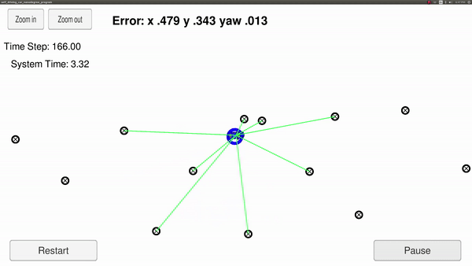
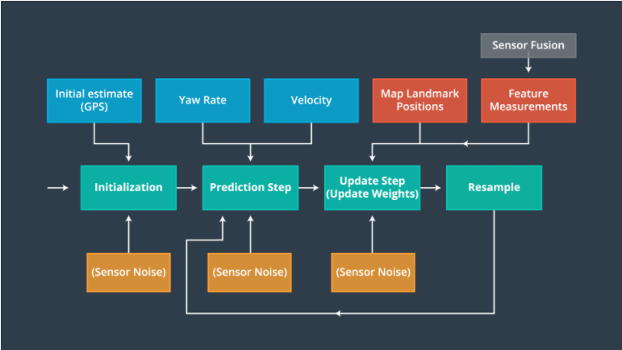
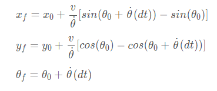
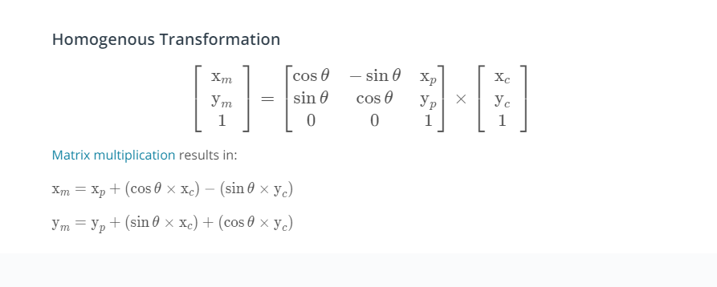
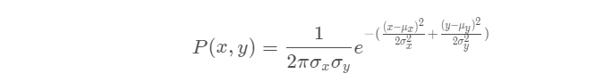

# Project 6 - Kidnapped Vehicle - Particle Filter Localization

Overview
---

In this project, we will implement a particle filter to localize a vehicle given its intial location (GPS) and distance from known landmarks on a map (measurement made by LIDAR). 

  
  
The 2D particle filter will be implemented in C++. The rubric to this project can be found [here](https://review.udacity.com/#!/rubrics/747/view). 

  
File Structure
---

* `main.cpp` -  This file runs the particle filter, measures the runtime calculate the weighted error at each timestep.  
    - Set the number of particles `num_particles` to draw.  
    - Set the control measurement uncertainty `signma_pos`  
    - Set the landmark measurment uncertainty `sigma_landmark`  
    - Reads in map data  
    - Reads in control data and;  
    - Reads in observation data for each timestep.  

* `particle_filter.cpp` 
    - `init` function takes GPS coordinates as input, intial heading estimate and an array of measurement uncertainties. To initialize all the particles, we distribute them using Gaussian distribution. Each particle has an initial weight of 1.
    
    - `prediction` takes as input the time interval since the last update, the position of the vehicle, the velocity, and the yaw rate. The function then updates the particle position estimates and adds Gaussian noise to account for uncertainty in measurements.
    
    - `updateWeights` function takes as input the range of the sensor, the landmak measurement uncertainties, and the map landmarks. It then modifies the weight of the particles to match the likelihood of the vehicle being at this place given the car prediction.
      
    
    - `resample` function, use the weights of the particles in the particle filter to update the particles to a Bayesian posterior distribution.  

    - `weighted_mean_error` evalulates the performance of the particle filter by calculating the weighted error.  
Algorithm
---

**Implementation of Particle Filter**

**Initialization:**  

Initializes particle filter to Gaussian distribution around first position and all the weights to 1.  The particles are initialized with a GPS position and heading. Every feasible position on the grid is called a particle and it represents a likely position of the vehicle inside the GPS location. 

**Prediction:**  
  
Each particle represents a prior belief about the location and orientation of the vehicle. They are derived from a single, course prior provided by a GPS measurement. Once initialized, we have to improve the belief by sensing the environement and this is done by the prediction step. The formula used to calculate the location of each particle at the next step can be seen below:
    

  

**Update Weights:**  
    
The LIDAR sensor receives the measurements as a list of x, y coordinates and sensor noise. We need to transform the coordinate from the car's system to the map to calculate the paticles' weight. The homogenous transformation matrix used to do so can be found below:

  
    
Each measurement from the LIDAR's point cloud is associated to a landmard using nearest neighbor. The particle with the smallest deviation from a landmark's location is associated to the landmark. The diviation between the observed landmark'd location and the true location results in a multivariate Gaussian probability. For each observation, the distribution is calculated and all resulting probabilites are multiplied, resulting in the particle weight. The goal is to have particles with highest weight to survive.
                    

  

**Resampling:**  

Resampling involves keeping the particles with higher weights since they have higher posterior probability. This leads to more accurate new prior at each recursive step. The new priors are more reliable than the orignal priors, but slightly less reliable than the posteriors calculated, as uncertainty increases with movement. 

Results
---

The particle filter implemented meets the rubric's requirement. It was able to localize the car accurately. A video demoing its performance can be found in the media folder.e  

Remarks
---
 
This project was a hands on experience of simultaneous, localization, and mapping (SLAM) which is an essential section in the development of autonomous vehicles. 
