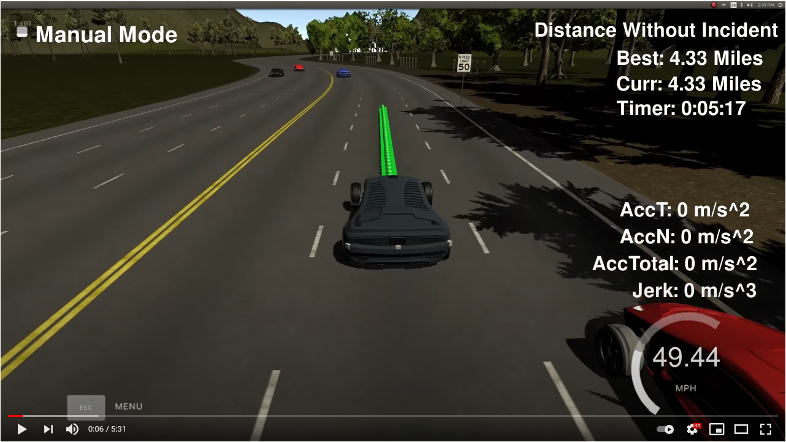

# Project 7 - Highway Driving Path Planning - Trajectory Generation

[](http://www.udacity.com/drive)


Overview
---
The goal of this project is to navigate safely around a virtual highway through traffic with a speed limit of 50 MPH. Using the car's localization, HD maps and sensor fusion data, we will predict a suitable path for the car. The criteria found in the project [rubic](https://review.udacity.com/#!/rubrics/1971/view) is key to success. We want to keep the as close as the speed limit without going over. Most importantly, we want he car to navigate safely and loop around the map with no accident, and no accelaration over 10 m/s<sup>2</sup> or jerk over 10 m/s<sup>3</sup> for the comfort of the passenger.

<p align="center">
  
   
Simulator
---  

You can download the Term3 Simulator which contains the Path Planning Project from the [releases tab (https://github.com/udacity/self-driving-car-sim/releases/tag/T3_v1.2).  

To run the simulator on Mac/Linux, first make the binary file executable with the following command:
```shell
sudo chmod u+x {simulator_file_name}
```

Dependencies
---

* This project requires [C++](https://isocpp.org/) and the following C++ libraries installed:    
  * spline.h  
* cmake >= 3.5
  * All OSes: [click here for installation instructions](https://cmake.org/install/)
* make >= 4.1
  * Linux: make is installed by default on most Linux distros
  * Mac: [install Xcode command line tools to get make](https://developer.apple.com/xcode/features/)
  * Windows: [Click here for installation instructions](http://gnuwin32.sourceforge.net/packages/make.htm)
* gcc/g++ >= 5.4
  * Linux: gcc / g++ is installed by default on most Linux distros
  * Mac: same deal as make - [install Xcode command line tools]((https://developer.apple.com/xcode/features/)
  * Windows: recommend using [MinGW](http://www.mingw.org/)
* [uWebSockets](https://github.com/uWebSockets/uWebSockets)
  * Run either `install-mac.sh` or `install-ubuntu.sh`.
  * If you install from source, checkout to commit `e94b6e1`, i.e.
    ```
    git clone https://github.com/uWebSockets/uWebSockets 
    cd uWebSockets
    git checkout e94b6e1
    ``  
Map & Localization Data Variables for Sensor Fusion and Localization
---  

The map of the highway is in `data/highway_map.txt`
Each waypoint in the list contains  `[x,y,s,dx,dy]` values. 

Here is the data provided from the Simulator to the C++ Program

#### Main car's localization Data (No Noise)

`x` The car's x position in map coordinates

`y` The car's y position in map coordinates

`s` The car's s position in frenet coordinates

`d` The car's d position in frenet coordinates

`yaw`  The car's yaw angle in the map

`speed` The car's speed in MPH
   
The highway's waypoints loop around so the frenet `s` value, distance along the road, goes from 0 to 6945.554.

#### Previous path data given to the Planner

`previous_path_x` The previous list of x points previously given to the simulator

`previous_path_y` The previous list of y points previously given to the simulator

#### Previous path's end s and d values 

`end_path_s` The previous list's last point's frenet s value

`end_path_d` The previous list's last point's frenet d value

#### Sensor Fusion Data, a list of all other car's attributes on the same side of the road. (No Noise)

`sensor_fusion` A 2d vector of cars and then that car's [car's unique ID, car's x position in map coordinates, car's y position in map coordinates, car's x velocity in m/s, car's y velocity in m/s, car's s position in frenet coordinates, car's d position in frenet coordinates. 

Details
---  
   
<p align="center">
  
      
The car visits every point it receives at a rate of .02 seconds. The spacing between each points represents the speed of the car. The vector going from a point to the next point in the list dictates the angle of the car. Acceleration both in the tangential and normal directions is measured along with the jerk, the rate of change of total Acceleration. 
  
The concept of finite state machine was implemented for the path planning. To respect the traffic laws, we use the left lane just to overtake cars. This leaves the lane free for anyone who wishes to overtake. The car's default state is also set to the middle lane. This maximizes the amount of ways we can overtake a slow car in front of us and ensures we do not get stucks between 2 slow cars. To remedy for the latency between the simulator and the algorithm, we save the last points to smoothen the transition. `previous_path_x` and `previous_path_y` helps this transition since they show the last points given to the simulator controller with the processed points already removed. All we have to do is return a path that extends this previous path or make sure to create a new path that has a smooth transition with this last path.

We use the spline library to smoothen the path between points.

Results
---

The algorithm works remarkably well. It makes the car successfully overtake one or multiple vehicle at a time, avoid any cars, even those abruptly changing lane and never exceeds the acceleration or jerk limit. It can even process a double lane switch smoothly if needed. The car has successfully navigated 30+ miles without incident. Below is a video of the car performing one lap.
   
[](https://www.youtube.com/watch?v=ldSsrDLABnE)
