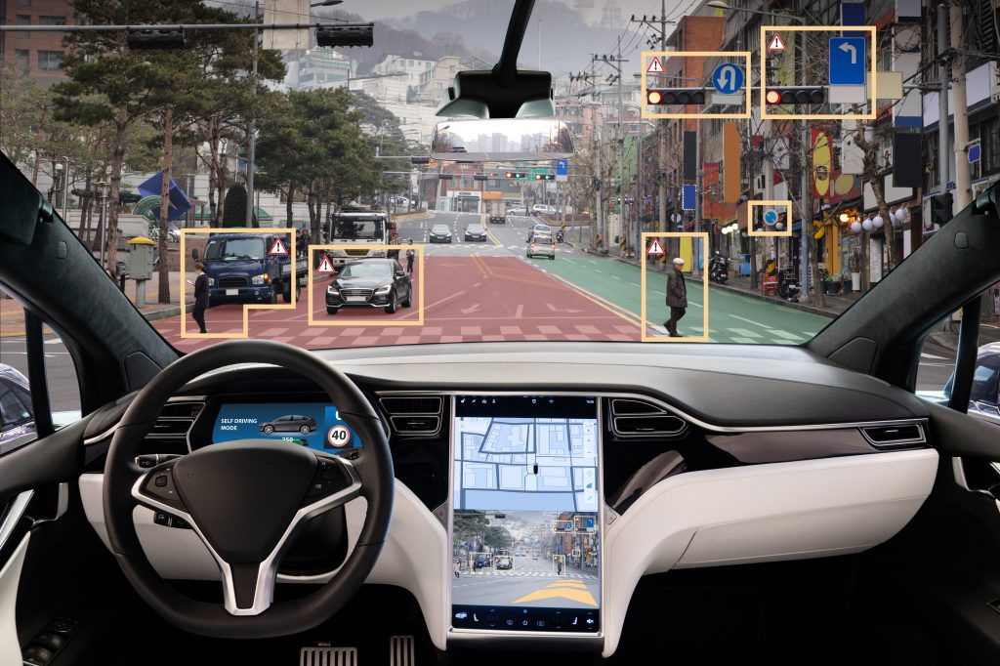

# Project 9 - Capstone

## Overview
The goal of this project is to put in use all the knowledge learned in this course to implement a program that will run on a self-driving car. The following subsections will be covered in this project:
* Perception: Detecting traffic light
* Plannnig: Waypoint updated based on traffic light
* Control: Taking trajectory information as input and performing the control of the car using PID controller
The criteria found in the project [rubic](https://review.udacity.com/#!/rubrics/3058/view) is key to success. 

  

## System Architecture Diagram
For this project, I wrote ROS nodes to implement core functionality of the autonomous vehicle system, including traffic light detection, control, and waypoint following!
The following is a system architecture diagram showing the ROS nodes and topics used in the project.
 

  

Code Structure
---  
Below is a brief overview of the repo structure, along with descriptions of the ROS nodes.

/ros/src/tl_detector/
---
This package contains the traffic light detection node: tl_detector.py. This node takes in data from the /image_color, /current_pose, and /base_waypoints topics and publishes the locations to stop for red traffic lights to the /traffic_waypoint topic.

The /current_pose topic provides the vehicle's current position, and /base_waypoints provides a complete list of waypoints the car will be following.
  
I built both a traffic light detection node and a traffic light classification node. Traffic light detection should take place within tl_detector.py, whereas traffic light classification should take place within ../tl_detector/light_classification_model/tl_classfier.py.
  

  

/ros/src/waypoint_updater/
 ---
This package contains the waypoint updater node: waypoint_updater.py. The purpose of this node is to update the target velocity property of each waypoint based on traffic light and obstacle detection data. This node will subscribe to the /base_waypoints, /current_pose, /obstacle_waypoint, and /traffic_waypoint topics, and publish a list of waypoints ahead of the car with target velocities to the /final_waypoints topic.
 

  
 
 /ros/src/twist_controller/
 ---
Carla is equipped with a drive-by-wire (dbw) system, meaning the throttle, brake, and steering have electronic control. This package contains the files that are responsible for control of the vehicle: the node dbw_node.py and the file twist_controller.py, along with a pid and lowpass filter that you can use in your implementation. The dbw_node subscribes to the /current_velocity topic along with the /twist_cmd topic to receive target linear and angular velocities. Additionally, this node will subscribe to /vehicle/dbw_enabled, which indicates if the car is under dbw or driver control. This node will publish throttle, brake, and steering commands to the /vehicle/throttle_cmd, /vehicle/brake_cmd, and /vehicle/steering_cmd topics. 

  
 
## Implementation

Perception
---
 Using Computer Vision, the camera detects the color and the traffic light and takes a decision based on the color
 * Red: Stops
 * Yellow: Does not speed up
 * Green: Go
 
Planning
---
Between each waypoints loaded to the car, the planner determines the accelaration. It is also responsible for slowing a car down when a red light is detected. 
 
Control
---
Based on the planning subsystem, the controls take care of the steering and throttling of the car. It ensures that the waypoints are followed correctly while driving with minium jerk. A PID controller is used in this subsytem.
 
 ## Results
 ---
Red Light                |  Green Light		|
:-------------------------:|:--------------------------:
   | 
 
 
 
As seen on the gif above, the simulated car handles traffic lights rather well. 
The car is also capable of the following:
* Comfortable steering thanks to the PID controller
* Getting to the different waypoints
* Minimize jerk to provide a smooth ride
  
## Conclusion
This project was really fun! Given more time to work on it, I would get the light classifier to work.
  
